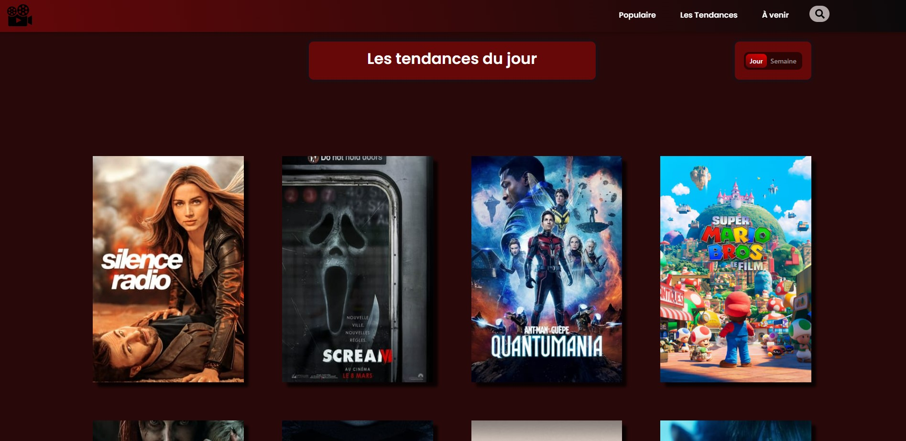

# MovieWiki

MovieWiki est une application front-end en Angular avec TypeScript qui utilise l'API de TMDB pour répertorier tous les films sortis et à venir en qu'elle que sorte un concurant d'Allociné. Voici les principales fonctionnalités.

## fonctionnalités :

 - Section de recherche de films pour trouver facilement des films spécifiques.
  
     
 
 - Liste des films et séries les plus populaires de la semaine.
  
     
 
 - Liste des films et séries les plus populaires du jour.
 
     
 
 - Liste des films à venir avec un tri par note.

 
     
 

 - Page d'information détaillée pour chaque film, comprenant :
    - Description
    - Titre du film
    - Bande annonce
    - Note du film
    - Budget consacré à la réalisation du film
    - Gain généré par le film
    - Liste de tous les acteurs
    
    
    
    - Possibilité de cliquer sur un acteur pour accéder à une description de l'acteur, sa date de naissance et tous les films dans lesquels il a joué.
    
    

En somme, MovieWiki est une application très complète qui permet aux utilisateurs de rechercher, de découvrir et d'en apprendre davantage sur les films et les acteurs qu'ils aiment.

